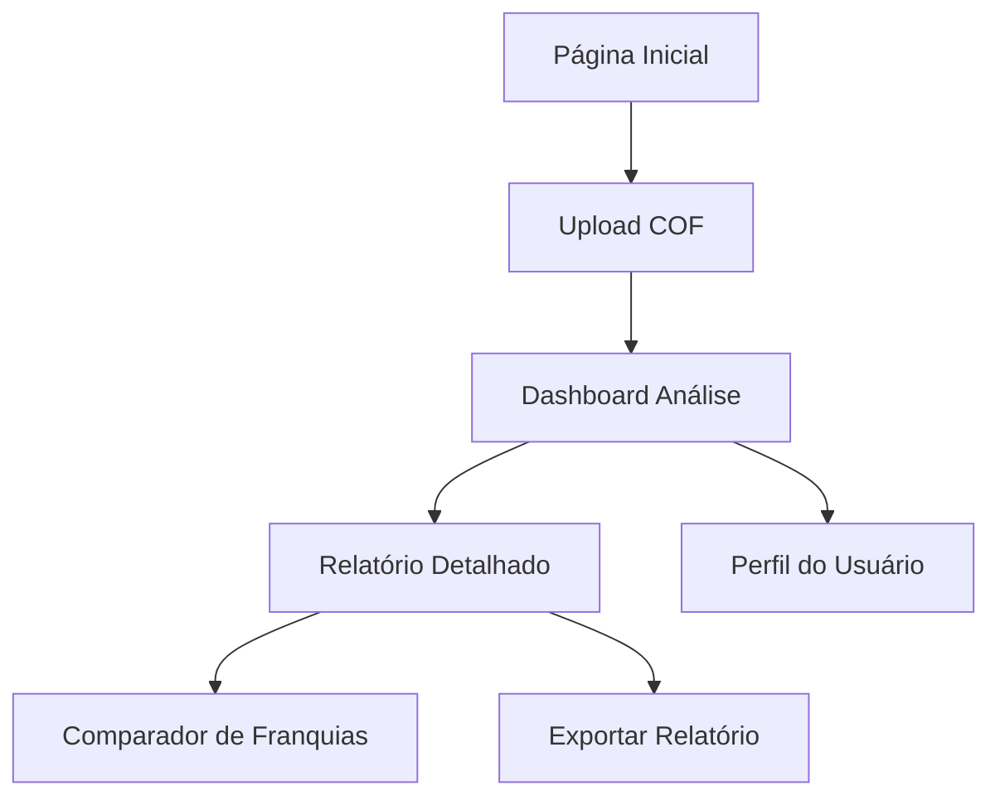

## 1. Visão Geral do Produto
O Expert COF é uma aplicação SaaS especializada na análise de Circular de Oferta de Franquia (COF) para o mercado brasileiro de franchising. A plataforma utiliza inteligência artificial para extrair, analisar e avaliar documentos COF, fornecendo insights sobre riscos, armadilhas contratuais e viabilidade financeira de investimentos em franquias.

- Resolve o problema da análise manual e demorada de documentos complexos de COF
- Permite que franqueados, consultores e advogados tomem decisões de investimento mais informadas
- Reduz riscos de investimentos inadequados através de análise automatizada de cláusulas contratuais

## 2. Funcionalidades Principais

### 2.1 Papéis de Usuário
| Papel | Método de Registro | Permissões Principais |
|------|---------------------|------------------|
| Franqueado | Cadastro por email | Upload de COF, análise básica, visualização de relatórios |
| Consultor | Cadastro por email com verificação | Análise avançada, benchmarking, exportação de relatórios |
| Advogado | Cadastro com verificação de OAB | Acesso completo, análise jurídica detalhada, validação de cláusulas |
| Admin | Acesso interno restrito | Gestão de usuários, visão global de métricas, configuração de sistema |

### 2.2 Módulos de Funcionalidade
A aplicação Expert COF consiste nas seguintes páginas principais:
1. **Página Inicial**: apresentação do serviço, planos de assinatura, call-to-action para upload.
2. **Dashboard de Análise**: upload de PDF, visualização de progresso, resultados da análise AI.
3. **Relatório Detalhado**: análise de riscos, cálculos financeiros, benchmarking com setor.
4. **Comparador de Franquias**: comparativo entre múltiplas COFs analisadas.
5. **Perfil do Usuário**: configurações, histórico de análises, plano de assinatura.
6. **Painel Admin (Futuro)**: gestão de usuários e métricas do sistema (preparado no backend).

### 2.3 Detalhamento das Páginas
| Nome da Página | Módulo | Descrição da Funcionalidade |
|-----------|-------------|---------------------|
| Página Inicial | Hero Section | Apresentação do valor da plataforma com estatísticas de economia de tempo e redução de riscos. |
| Página Inicial | Seção de Upload | Drag-and-drop para PDF de COF com preview e validação de formato. |
| Página Inicial | Planos de Assinatura | Cards comparativos entre plano gratuito (análise básica) e premium (análise completa). |
| Dashboard | Processamento de Documento | Barra de progresso mostrando extração de texto, OCR e análise por IA. |
| Dashboard | Visualização de Resultados | Cards com indicadores de risco (alto/médio/baixo), score de viabilidade e alertas principais. |
| Relatório Detalhado | Análise de Riscos | Lista de cláusulas problemáticas com explicação em linguagem simples e sugestões de ação. |
| Relatório Detalhado | Análise Financeira | Tabela com investimento inicial, royalties, projeções de ROI, payback e TIR com gráficos. |
| Relatório Detalhado | Benchmarking | Comparação com médias do setor (taxas de royalties, tempo de payback, taxa de sucesso). |
| Comparador | Seletor de COFs | Interface para selecionar múltiplas análises salvas para comparação lado a lado. |
| Comparador | Tabela Comparativa | Visualização em tabela das principais métricas entre franquias analisadas. |
| Perfil | Configurações | Gerenciamento de dados pessoais, preferências de notificação e idioma. |
| Perfil | Histórico | Lista de todas as análises realizadas com data, franquia e status de análise. |

### 2.4 Planos e Monetização
A plataforma adota um modelo Freemium com diferenciação clara de recursos:

| Funcionalidade | Plano Gratuito (Free) | Plano Profissional (Premium) |
|---|---|---|
| **Análises de COF** | Limite de 1 análise por dia | Ilimitado |
| **Relatório de Riscos** | Apenas alertas de nível "Crítico" | Todos os níveis (Crítico, Alto, Médio, Baixo) |
| **Análise Financeira** | Resumo básico (ROI estimado) | Detalhada (Payback, TIR, Fluxo de Caixa, Break-even) |
| **Benchmarking** | Média geral do setor | Comparativo detalhado por segmento e região |
| **Comparador** | Não incluído | Comparação ilimitada lado a lado |
| **Exportação** | Não incluído | PDF personalizado e Excel |
| **Suporte** | Email (48h) | Prioritário (24h) |

## 3. Fluxo Principal do Usuário
### Fluxo do Franqueado
1. Usuário acessa página inicial e faz upload do PDF da COF
2. Sistema processa documento e extrai informações via OCR e IA
3. Dashboard mostra análise preliminar com principais alertas
4. Usuário visualiza relatório detalhado com análise de riscos e financeira
5. Sistema sugere ações baseadas nos achados da análise

### Fluxo do Consultor/Advogado
1. Profissional faz login e acessa dashboard completo
2. Upload de múltiplas COFs para análise comparativa
3. Acesso a relatórios avançados com benchmarking setorial
4. Exportação de relatórios em PDF para clientes
5. Gerenciamento de múltiplos clientes e análises

## 4. Design da Interface

### 4.1 Estilo de Design
- **Cores Primárias**: Azul escuro (#1e40af) para confiança e profissionalismo
- **Cores Secundárias**: Verde (#10b981) para indicadores positivos, Vermelho (#ef4444) para alertas
- **Estilo de Botões**: Arredondados com sombras suaves, hover effects sutis
- **Fonte**: Inter para textos, Roboto Mono para dados financeiros
- **Layout**: Baseado em cards com espaçamento generoso, navegação superior fixa
- **Ícones**: Estilo line icons da Heroicons para consistência

### 4.2 Visão Geral das Páginas
| Nome da Página | Módulo | Elementos de UI |
|-----------|-------------|-------------|
| Página Inicial | Hero Section | Background gradient azul-claro, headline sobre "Análise Inteligente de COF", CTA principal "Começar Análise Gratuita" |
| Dashboard | Upload Area | Dropzone com borda tracejada, preview do PDF, botão "Analisar Agora" destacado em verde |
| Dashboard | Resultados | Cards com métricas (Score de Risco, ROI Estimado, Tempo de Payback), gráfico de barras para custos |
| Relatório | Análise de Riscos | Lista expansível de alertas, categorizados por severidade (vermelho/âmbar/verde) |
| Relatório | Financeiro | Tabela responsiva com valores, gráfico de linha para projeções de receita ao longo do tempo |

### 4.3 Responsividade
- **Desktop-first**: Otimizado para telas grandes (1920x1080) com aproveitamento máximo do espaço
- **Mobile-adaptive**: Layout adaptável para tablets e smartphones com menu hambúrguer
- **Touch optimization**: Botões e elementos de interação com área mínima de 44px para touch

### 4.4 Visualizações de Dados
- Gráficos de barras empilhadas para breakdown de custos
- Gráficos de linha para projeções temporais de ROI
- Gauge charts para score de viabilidade
- Tabelas comparativas com highlighting de valores críticos