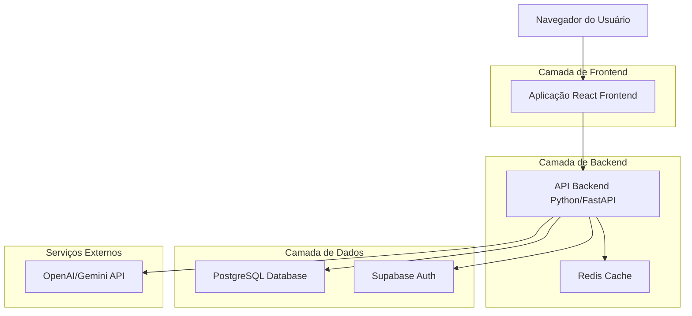

## 1. Arquitetura do Sistema



## 2. Descrição das Tecnologias

- **Frontend**: React@18 + TailwindCSS@3 + Vite
- **Ferramenta de Inicialização**: vite-init
- **Backend**: Python@3.11 + FastAPI
- **Banco de Dados**: PostgreSQL@15
- **Cache**: Redis@7
- **Autenticação**: Supabase Auth
- **IA/ML**: Google Gemini (gemini-2.0-flash-lite-preview-02-05 com fallback para gemini-flash-latest)
- **Processamento de PDF**: PyPDF2 + pdfplumber
- **OCR**: Tesseract OCR
- **NLP**: spaCy + NLTK

## 3. Definições de Rotas

| Rota | Propósito |
|-------|---------|
| / | Página inicial com apresentação e upload |
| /dashboard | Dashboard principal com análises e métricas |
| /analysis/:id | Página de relatório detalhado de uma análise |
| /compare | Comparador de múltiplas análises |
| /profile | Perfil do usuário e configurações |
| /login | Página de autenticação |
| /register | Página de registro de novo usuário |
| /pricing | Página de planos e preços |

## 4. Definições de API

### 4.1 Autenticação
```
POST /api/auth/register
```

Request:
| Parâmetro | Tipo | Obrigatório | Descrição |
|-----------|-------------|-------------|-------------|
| email | string | true | Email do usuário |
| password | string | true | Senha (mínimo 8 caracteres) |
| name | string | true | Nome completo |
| role | string | true | Papel: 'franchisee', 'consultant', 'lawyer' |

Response:
```json
{
  "user": {
    "id": "uuid",
    "email": "user@example.com",
    "name": "João Silva",
    "role": "franchisee"
  },
  "token": "jwt_token"
}
```

### 4.2 Upload e Análise de COF
```
POST /api/cof/upload
```

Request (multipart/form-data):
| Parâmetro | Tipo | Obrigatório | Descrição |
|-----------|-------------|-------------|-------------|
| file | file | true | Arquivo PDF da COF (máx 10MB) |
| franchise_name | string | true | Nome da franquia |

Response:
```json
{
  "analysis_id": "uuid",
  "status": "processing",
  "estimated_time": "3-5 minutes"
}
```

### 4.3 Obter Resultados da Análise
```
GET /api/cof/analysis/:id
```

Response:
```json
{
  "id": "uuid",
  "franchise_name": "Franquia Teste",
  "upload_date": "2024-01-06T10:00:00Z",
  "risk_score": 7.5,
  "financial_analysis": {
    "initial_investment": 150000,
    "royalty_fee": 0.08,
    "marketing_fee": 0.03,
    "estimated_roi": 0.25,
    "payback_period": 24
  },
  "risk_alerts": [
    {
      "type": "high_royalty",
      "severity": "high",
      "description": "Taxa de royalty acima da média do setor",
      "recommendation": "Negociar redução ou buscar alternativas"
    }
  ]
}
```

## 5. Arquitetura do Servidor

```mermaid
graph TD
    A[Cliente / Frontend] --> B[Camada de Controller]
    B --> C[Camada de Serviço]
    C --> D[Camada de Repositório]
    D --> E[(PostgreSQL)]
    C --> F[Serviço de IA]
    C --> G[Processador de PDF]
    C --> H[Gerenciador de Planos/Limites]

    subgraph "Servidor Backend"
        B
        C
        D
        F
        G
        H
    end

### 5.1 Componente de Gestão de Planos
O `Gerenciador de Planos/Limites` é responsável por:
- Validar se o usuário possui cota disponível para nova análise.
- Filtrar dados sensíveis/premium na resposta da API com base no plano do usuário.
- Gerenciar upgrades e downgrades de assinatura (integração futura com gateway de pagamento).

## 6. Modelo de Dados

### 6.1 Definição do Modelo de Dados

```mermaid
erDiagram
    USER ||--o{ ANALYSIS : performs
    USER {
        UUID id PK
        STRING email UK
        STRING password_hash
        STRING name
        STRING role
        STRING plan
        TIMESTAMP created_at
        TIMESTAMP updated_at
    }
    
    ANALYSIS {
        UUID id PK
        UUID user_id FK
        STRING franchise_name
        STRING file_path
        JSON extracted_data
        JSON risk_analysis
        JSON financial_analysis
        ENUM status
        TIMESTAMP created_at
    }
    
    ANALYSIS ||--o{ RISK_ALERT : contains
    RISK_ALERT {
        UUID id PK
        UUID analysis_id FK
        STRING type
        STRING severity
        STRING description
        STRING recommendation
        JSON metadata
    }
```

### 6.2 Linguagem de Definição de Dados (DDL)

**Tabela de Usuários (users)**
```sql
-- criar tabela
CREATE TABLE users (
    id UUID PRIMARY KEY DEFAULT gen_random_uuid(),
    email VARCHAR(255) UNIQUE NOT NULL,
    password_hash VARCHAR(255) NOT NULL,
    name VARCHAR(100) NOT NULL,
    role VARCHAR(20) NOT NULL CHECK (role IN ('franchisee', 'consultant', 'lawyer', 'admin')),
    plan VARCHAR(20) DEFAULT 'free' CHECK (plan IN ('free', 'premium', 'enterprise')),
    usage_count INTEGER DEFAULT 0,
    created_at TIMESTAMP WITH TIME ZONE DEFAULT NOW(),
    updated_at TIMESTAMP WITH TIME ZONE DEFAULT NOW()
);

-- criar índices
CREATE INDEX idx_users_email ON users(email);
CREATE INDEX idx_users_role ON users(role);
CREATE INDEX idx_users_plan ON users(plan);
```

**Tabela de Análises (analyses)**
```sql
-- criar tabela
CREATE TABLE analyses (
    id UUID PRIMARY KEY DEFAULT gen_random_uuid(),
    user_id UUID NOT NULL REFERENCES users(id) ON DELETE CASCADE,
    franchise_name VARCHAR(255) NOT NULL,
    file_path VARCHAR(500) NOT NULL,
    file_hash VARCHAR(64), -- SHA-256 hash para deduplicação
    extracted_data JSONB,
    risk_analysis JSONB,
    financial_analysis JSONB,
    status VARCHAR(20) DEFAULT 'processing' CHECK (status IN ('processing', 'completed', 'failed')),
    created_at TIMESTAMP WITH TIME ZONE DEFAULT NOW(),
    updated_at TIMESTAMP WITH TIME ZONE DEFAULT NOW()
);

-- criar índices
CREATE INDEX idx_analyses_user_id ON analyses(user_id);
CREATE INDEX idx_analyses_status ON analyses(status);
CREATE INDEX idx_analyses_created_at ON analyses(created_at DESC);
```

**Tabela de Alertas de Risco (risk_alerts)**
```sql
-- criar tabela
CREATE TABLE risk_alerts (
    id UUID PRIMARY KEY DEFAULT gen_random_uuid(),
    analysis_id UUID NOT NULL REFERENCES analyses(id) ON DELETE CASCADE,
    type VARCHAR(50) NOT NULL,
    severity VARCHAR(10) NOT NULL CHECK (severity IN ('low', 'medium', 'high', 'critical')),
    description TEXT NOT NULL,
    recommendation TEXT,
    metadata JSONB,
    created_at TIMESTAMP WITH TIME ZONE DEFAULT NOW()
);

-- criar índices
CREATE INDEX idx_risk_alerts_analysis_id ON risk_alerts(analysis_id);
CREATE INDEX idx_risk_alerts_severity ON risk_alerts(severity);
CREATE INDEX idx_risk_alerts_type ON risk_alerts(type);
```

## 7. Segurança e Conformidade

### 7.1 LGPD (Lei Geral de Proteção de Dados)
- Criptografia de dados em repouso e em trânsito
- Anonimização de dados sensíveis
- Consentimento explícito para processamento de dados
- Direito ao esquecimento implementado
- Logs de auditoria para acesso a dados

### 7.2 Segurança de Dados
- Autenticação JWT com refresh tokens
- Rate limiting por IP e usuário
- Validação de entrada contra SQL injection
- CORS configurado adequadamente
- HTTPS obrigatório para todas as comunicações

### 7.3 Armazenamento de Documentos
- PDFs armazenados em bucket S3 ou similar com criptografia
- URLs temporárias e assinadas para acesso
- Exclusão automática após período determinado (conforme LGPD)
- Backup regular com criptografia